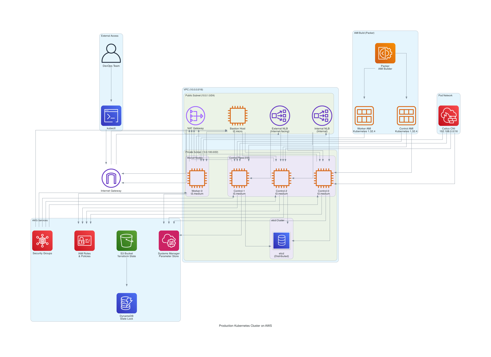

# 🚀 Kubernetes on AWS with Terraform

Production-grade, highly available Kubernetes cluster on AWS.

## ✅ Implemented Features

- ✅ `kubeadm` + Terraform
- ✅ HA control plane
- ✅ Dual NLB (external + internal) for control plane
- ✅ Calico CNI
- ✅ SSM for secure secret sharing
- ✅ Automated kubeconfig generation

## 📋 Todo Features

- ☐ Worker Auto Scaling Group
- ☐ AWS CCM & EBS CSI
- ☐ etcd backups to S3 (hourly)
- ☐ Helm-ready applications (Istio, Prometheus, Argo CD)
- ☐ Istio & Gateway API

## 🔧 Architecture

 *(optional)*

## 📋 Prerequisites

- AWS Account
- AWS CLI configured (`aws configure`)
- SSH key pair uploaded to AWS
- Terraform 1.5+
- `kubectl`, `aws`, `ssh`

## 🚀 Getting Started

### Provisioning a New Cluster

For detailed instructions on provisioning a new Kubernetes cluster, see the [cluster-provision README](./cluster-provision/README.md).

Quick start:

```bash
cd cluster-provision

# Copy and edit the variables file
cp terraform.tfvars.example terraform.tfvars

# Initialize and apply Terraform
terraform init
terraform apply
```
## 🔒 Security Features

- Private subnets for all Kubernetes nodes
- NAT Gateway for outbound internet access
- Restricted security groups with configurable CIDR blocks
- Encrypted root volumes
- SSM Parameter Store for secure token and certificate sharing

## 📋 Kubeconfig

After deployment, the kubeconfig will automatically generated on the same directory or available as a Terraform output:

```bash
cd cluster-provision
terraform output -raw kubeconfig > ~/.kube/config
chmod 600 ~/.kube/config
```

The certificates and keys are automatically extracted from the cluster and securely stored in AWS SSM Parameter Store.

## 🛠️ Troubleshooting

For common issues and solutions during cluster provisioning and management, see the [Troubleshooting Guide](./docs/TROUBLESHOOTING.md).

## 🔧 Customization

Edit the variables in the cluster-provision directory:

- Kubernetes version
- Instance types and counts
- Network CIDRs
- Security group access restrictions
- Root volume sizes
- AWS region and availability zones

## 🔄 Cluster Lifecycle Management

This repository separates cluster provisioning to support different CI/CD pipelines:

### 🤖 CI/CD Integration (only for reference not tested)

This repository includes GitHub Actions workflows for automated provisioning:

- **Provisioning**: `.github/workflows/provision.yml` - Automates cluster deployment
